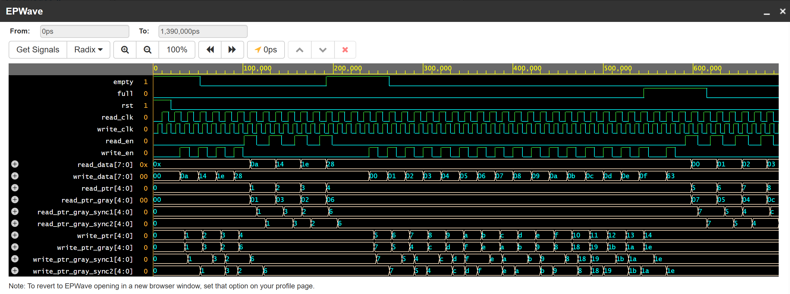

# async-fifo

SystemVerilog implementation and verification of a parameterizable asynchronous FIFO.

## Description

This project implements a parameterizable Asynchronous FIFO in SystemVerilog.

The FIFO has independent read and write clock domains, so it can transfer data between clock domains with different frequencies and phases.

## Parameters

- `DATA_WIDTH` — number of bits stored in each FIFO entry. Default: `8`
- `FIFO_DEPTH` — number of entries in the FIFO. Default: `16`

## Implementation

The FIFO uses:

- memory for storing data;
- separate read and write pointers;
- Gray-code pointers for clock-domain crossing (CDC);
- two-stage synchronizers for the pointers;
- `full` and `empty` flags;
- an asynchronous reset shared by both clock domains.

Data is written only when `write_en` is high and the FIFO is not full.

Data is read only when `read_en` is high and the FIFO is not empty.

## Verification

The testbench uses two independent clocks:

- Write clock: 10 ns period
- Read clock: 14 ns period

The testbench checks:

- reset;
- writing and reading data;
- FIFO empty condition;
- FIFO full condition;
- writing while the FIFO is full;
- reading all FIFO contents;
- reading while the FIFO is empty;
- simultaneous read and write operations;
- correct data ordering using an expected-value queue.

The testbench performs automatic checking using `$error` and `$display`.

## How to Run

The design can be simulated using EDA Playground.

1. Open EDA Playground.
2. Select **SystemVerilog/Verilog** as the language.
3. Select **Siemens Questa** as the simulator.
4. Put the testbench code in the **Testbench** section.
5. Put the `async_fifo` RTL module in the **Design** section.
6. Save the playground.
7. Click **Run**.
8. Check the simulation output for `PASSED` messages and errors.
9. Open **EPWave** to view the waveforms.

The testbench also generates a VCD waveform file using `$dumpfile` and `$dumpvars`. The VCD file can be viewed in EPWave.

## Waveform

The waveform below shows the FIFO operation during simulation, including the
independent read and write clocks, data transfers, FIFO status flags, and
synchronized Gray-code pointers.

